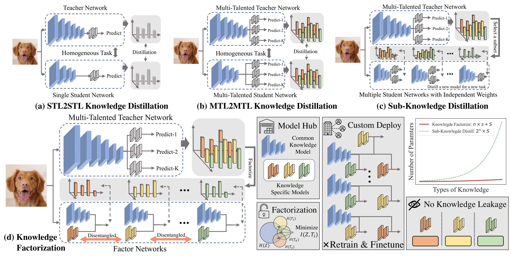

# Factorizing Knowledge in  Neural Networks
This is a PyTorch implementation of the paper

**Factorizing Knowledge in  Neural Networks(ECCV 2022)** [pdf](https://arxiv.org/abs/2207.03337)

*Xingyi Yang, Jingwen Ye, Xinchao Wang* 

In this paper, we explore a novel and ambitious knowledge-transfer task, termed Knowledge Factorization~(KF). The core idea of KF lies in the modularization 
and assemblability of knowledge: given a pretrained network model as input, KF aims to decompose it into several factor networks, each of which handles only a dedicated task and maintains task-specific knowledge factorized from the source network.

## Licence
This project is released under the [Apache 2.0 license](LICENCE).

## Citation
If you find this project useful in your research, please consider cite:

        @Article{yang2022knowledgefactor,
        author  = {Xingyi Yang, Jingwen Ye, Xinchao Wang},
        title   = {Factorizing Knowledge in  Neural Networks},
        journal = {European Conference on Computer Vision},
        year    = {2022},
        }
